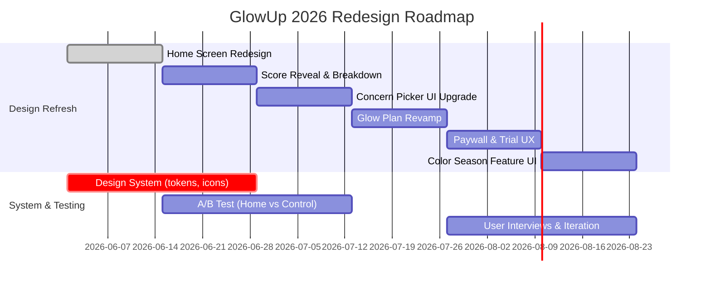

# Executive Summary  
GlowUp targets high-end female beauty/wellness. Academic and industry data highlight key risks and opportunities: self-quantification can boost engagement and motivation but may harm self-image without sensitive framing. AI-driven “before/after” and color-analysis tools have gone viral (TikTok #coloranalysis: 631M views) but demand transparency: ~90% of consumers want to know if images are AI-generated and 98% say “authentic” visuals are key to trust. Premium wellness apps (Health/Fitness category) see ~12% median download-to-paid conversion with hard paywalls (vs ~2% for freemium), and ~40% of trial users convert. Top apps emphasize habit-formation (higher 30-day retention ~40–68% for leaders). In beauty/AR, Sephora’s AR try-on tripled purchase likelihood and cut returns 30%; YouCam Makeup has 900M+ downloads and drove brand conversions ~2.5×. Design best practices for “clinical-luxe” UIs favor a refined palette (soft rose & rose-gold accents), 4pt spacing grid, consistent corner radii (8–24px), subtle shadows/glassmorphism, and a strong type hierarchy (e.g. a neutral sans serif like Inter 16px for body, a serif display like Fraunces/Canela 24–32px for headers). All text must meet AA contrast (≥4.5:1).  

**Key Recommendations:** Refresh GlowUp screens with depth and luxury cues: glass-blur panels, metallic pink-gold highlights, soft shadows. Strengthen visual hierarchy (bolder scores, clearer icons). Prioritize persona needs: Glass-Skin users want weekly progress graphs and proof images; Color-Purists want teaser “season” reveals and shareable palettes; Corporate users want quick-check summaries and minimalist styling. Restructure paywalls and trials: emphasize value (e.g. “unlock full analysis and plan”), offer 7–14 day free trial (health/wellness apps often use 5–9 day trials), test both weekly and annual plans (H&F apps skew 67% annual).  

**Measurement & Risks:** Track funnel events (QuizStart/Complete → Scan → ScoreReveal → PaywallView → Subscribe) and monitor key metrics (download→trial→paid conversion, Day-1/7/30 retention, ARPU, NPS). Use power calculations: e.g. detecting a +5pp conversion lift (20→25%) needs ~2,200 users (1100 per A/B group). Mitigate privacy/regulatory risk: process/erase images on-device if possible; label any face recognition; avoid medical claims. Apple requires transparency and forbids “influencing perceived attractiveness” without safeguards (images must be opt-in and privacy-protected).  

## Product Context & Personas  
GlowUp (“GlowScore”) is a premium “looksmaxxing” app for adult US women. It promises a **Derm-inspired “Facial Harmony” score** and personalized plan, gated behind a subscription (hard paywall: $12.99/wk, $59.99/yr, $99.99 lifetime). Key user personas are: **Glass-Skin Devotee** (18–30, skincare-obsessed, tracks weekly progress and “proof”), **Color Analysis Purist** (18–34, beauty/aesthetics-oriented, seeks seasonal palette and shareable results), and **Corporate Ascender** (22–28, image-conscious professional, values efficiency and “clean/quiet luxury”). Secondary personas include brides-to-be, pro-aging, corrective makeup. The app’s features span a face scan (yielding a 0–100 Facial Harmony score with subscores: skin, symmetry, eyes, jawline, nose/lips, harmony), AI “Maxed-Out Self” (age-progression/regression while retaining identity), a stress-faced index (“Cortisol Face”), personal Color Season analysis, Visual Weight analysis, circadian skincare planner, a 3D “Concerns Picker” (selecting issues like acne, puffiness, asymmetry), a persona-tailored glow-up task plan, and a “Studio” for AR makeover filters (makeup, hair, relight, headshot, aging, fitness).

## Competitive Landscape & Benchmarks  

| **App / Brand**  | **Category**       | **Pricing / Users**                           | **Key Features**                                    | **Metrics / Notes**                                         |
|------------------|--------------------|-----------------------------------------------|-----------------------------------------------------|-------------------------------------------------------------|
| **ŌURA Ring**    | Wearable + App     | $5.99/mo subscription; 5.5M rings sold total | Continuous HR/sleep/activity/stress metrics, women’s health tracking (perimenopause, pregnancy) | 2024 Rev ≈$500M (2x prior year); 2025 on track ~$1B; ~2M paying members (20% of Rev≈$110M); very high ARPU and retention for health device. |
| **Calm**         | Meditation wellness| ~$14.99/mo ($69.99/yr); ~3.5M subscribers (2025 est.) | Guided meditations, sleep stories, masterclasses      | 2025 Rev ≈$210M; Day-30 retention ~5–6% (industry-leading; most wellness apps ~<5%). |
| **Insight Timer**| Meditation wellness| Freemium; tip/donation model                 | Customizable timer, progress stats, community groups | 63% of US meditation-app time; Day-30 retention ~16% (far above Calm/Headspace ~5%).|
| **YouCam Makeup (Perfect Corp.)** | Beauty AR / Skin | Free + IAP; 900M+ downloads | Virtual makeup try-on, AI skin diagnostic (moisture, wrinkles, dark circles), skin “age” score, shopping integration | +32% spike in AR try-ons during COVID; brand partners saw ~2.5× conversion lift. Highly engaged Gen-Z user base. |
| **Sephora**      | Beauty Retail      | Free; loyalty-based (Beauty Insider)         | AR Virtual Artist (makeup try-on), Color IQ (skin tone scanner), AI SkinIQ (routine recommender), in-app shopping | Virtual try-on users are ~3× likelier to purchase; over 200M virtual makeup combinations tried. 40M loyalty members drive ~80% of NA sales. App sessions ↑12m avg (vs 3m) after personalization features. |
| **Attractiveness AI** | Face Rating (AppStore) | Free + Subscriptions; “18+ only”? (Age 9+) | AI Beauty score (scale), “encouraging feedback”, photo tips (lighting, framing), age-perception | Privacy-focused: “images are analyzed securely and never stored or shared”. Age rating 9+ suggests Apple allowed it under “Photo & Video.” Shows demand for vanity-boost apps, but user reviews warn of accuracy issues. |
| **Beauty Pie**   | Skincare retail    | $99/yr membership                          | Flat-fee access to premium skincare products        | Not an app metric, but shows consumers pay ~$100/yr for beauty expertise products. Sub model appeals via “value”. |

**Conversion & Retention Benchmarks:** Subscription apps with strong onboarding can double/triple median conversion. In wellness (Health & Fitness), median trial-to-paid is ~39.9%; top apps reach ~68%. Hard paywalls (no free tier) see ~12.1% median downloads→paid (vs 2.2% for freemium) and ~12.8% 30-day retention (vs 9.3% freemium). However, hard paywalls incur more refunds (median 5.8% vs 3.4%). Average 14-day ARPU for H&F apps is ~$0.44 (median). Calm’s ~5% Day-30 retention is unusually high; most meditation apps <5% (industry avg ~5.6%). Beauty apps see rapid virality: in the UK, ~27% of installs buy in 30d, reflecting strong mobile engagement.  

## Academic & Behavioral Insights  
**Facial Feedback and Behavior:** Quantified feedback can motivate improvement, but also risk negative body image. A meta-review found self-tracking tech **improves well-being** overall, yet **can harm self-esteem and body image**. Showing “before/after” or “score” can boost confidence if framed supportively, but may demotivate if results seem unattainable. Any “Facial Harmony” score must be presented as a positive guide, not an absolute judgment.  

**AI Imagery & Trust:** AI-enhanced before/after images (Maxed-Out Self) tap into social sharing (as with Snapchat beauty filters), but transparency is critical. Studies show AI-generated images of influencers hurt viewers’ body satisfaction, and ~90% of consumers globally want to know when content is AI-generated. Getty Images reports 98% of consumers say “authentic” imagery builds trust. GlowUp should label AI transformations (e.g. “simulated look”) and avoid claiming clinical accuracy.  

**Color Analysis Virality:** Seasonal color theory (finding your “season”) has resurged on TikTok: #coloranalysis videos have **631M+ views**. Ready-to-use AR filters (placing your face on colored backdrops) engage beauty enthusiasts. This trend means a Color Season feature can drive social shares and downloads. Embedding share-buttons (e.g. “post your seasonal palette”) can amplify virality.  

## UX Patterns & Paywall Strategy  

- **Hard Paywall Model:** GlowUp uses a hard paywall. Industry data suggests this works if value is crystal-clear upfront. All user flows should highlight locked premium features (e.g. “To see your full score and plan, upgrade”). Since hard-paywall apps convert instantly, it’s vital to maximize Day-0 engagement (like placing paywall just after scan). Monthly retention for hard-paywall users is higher, but refund risk is higher too, so emphasize a flexible guarantee or trial.  

- **Pricing & Trials:** Wellness apps often offer trials 5–9 days (80% of H&F apps). GlowUp could test a **7-day free trial** (collect payment later), which likely doubles conversion (RevenueCat finds longer trials yield ~45% median conversion). Offer both weekly and annual plans – 67% of H&F buyers choose annual. Show savings (e.g. “Save 30% with annual”).  

- **Onboarding Quiz:** Persona-aligned quizzes (already part of funnel) drive commitment. Use dynamic content: a quick outcome or personalized tip even before scanning to show value immediately.  

- **Analytics and Gamification:** Award “Badges” or “Streaks” for consistent use (like Insight Timer’s streak→ retention). Show charts of “Your skin score over time” to satisfy Glass-Skin Devotees. 

## Design System Recommendations  

- **Color Palette:** Refine current pinks to a *“clinical-luxe”* palette. Example tokens: Background #F9E0E8, Panel #FBEAF0, Card #FFFFFF, Borders #F2C4D2, Primary Rose #E0537A, Soft Rose #F8D4DF, Accent Rose-Gold #B76E79 (metallic highlight). Success Green #2E9E5B. Ensure all text meets WCAG AA contrast (>=4.5:1; e.g. #2D2330 on pink).  

- **Typography:** Use a **display serif** for branding and headers (e.g. Fraunces/Canela, 24–32px, SemiBold/Bold) paired with a **geometric sans-serif** for body (e.g. Inter/Geist, 14–16px, Regular/Medium). Maintain a clear hierarchy: e.g. Title 32px, Subtitle 24px, Body 16px, Footnote 12px. Ensure dynamic type compliance.  

- **Spacing & Layout:** 4pt base grid. Standard spacing tokens: 4, 8, 12, 16, 20, 24, 32, 40px. Rounded corners: buttons 24px (pill), cards/banners 16px, modals 20px. Use safe margins (16px) on edges.  

- **Depth & Shadow:** Employ soft drop shadows and subtle glassmorphism for premium feel. E.g. card shadow: rgba(0,0,0,0.08) 0px 4px 16px; overlay: backdrop-filter: blur(12px) with light border (e.g. 1px rgba(255,255,255,0.4)). Avoid heavy or colored shadows – keep them airy.  

- **Iconography:** Outline/glyph style in rose-gold (#B76E79) or white. Use consistent stroke width (2px). Consider custom icons for skincare (leaf/droplet), face-scan, color-palette.  

- **Motion:** Micro-interactions: subtle animations for score ring filling, tab transitions (fade/slide), paywall cards parallax. Keep motion slow and smooth to feel luxurious (e.g. 300–500ms ease). Use reveal animations for “unlocking” Score (e.g. blurred value sharpening).  

## Screen-by-Screen UI Recommendations  

### Home Screen (Dashboard)  
1. **Premium Score Ring:** Enlarge the Facial Harmony ring. Replace flat look with a glossy 3D ring or radial gradient highlight. Show “Harmony” label below in serif, and sub-scores (skin, symmetry, etc.) around the ring in a smaller font. This addresses the *Glass-Skin* user’s desire for credibility and detail.  
2. **Hierarchy of CTAs:** Simplify buttons to primary “Scan Face” (rose-gold background, white text) and secondary “View Plan”. Remove less-used actions or tuck them in a menu. For the *Corporate* persona, this makes the morning workflow faster.  
3. **Brand Banner & Depth:** Use a translucent glass panel behind the logo and user greeting, with a faint rose-gold glow. This adds luxury without clutter. Display weekly progress summary (“New high!”) for the *Devotee*.  

*Rationale:* A clear, elegant home with depth cues and focused CTAs maximizes initial impact. Glassmorphic panels and shadows signal premium quality (similar to Aura’s refined UI). Emphasizing the score ring and progress graph speaks to habit-trackers, while a clean minimalist layout reassures fast-paced professionals.  

### Facial Score Reveal  
1. **Tiered Reveal Animation:** When unlocking the score, play a short animation (ring “filling” or confetti burst). This moment feels rewarding. For *Color Purists*, reveal a slight overlay of their seasonal palette on the border.  
2. **Detailed Breakdown:** Below the main score, show subscores (“Skin: 85, Symmetry: 78, …”) with tooltips explaining each metric. Use color accents (e.g. green for above 80, amber below) to gamify progress. *Glass-Skin* users get actionable insight.  
3. **Before/After Carousel:** If “Maxed-Out Self” is enabled, allow swiping to toggle original vs improved image. Label clearly. Include a “Save” button. This addresses users’ craving for visible proof, but add a disclaimer (see privacy).  

*Rationale:* Gamified feedback (progress bars, animations) boosts motivation. Breaking down the score builds dermatological credibility. For *Purists*, glimpsing the color reveal ties into season analysis. Emphasizing strength (“You scored high on Eye Symmetry!”) builds confidence for *Corporate* users. Transparently labeling the AI enhancements (e.g. “Mockup: you could look ~5 years younger”) aligns with trust guidelines.  

### Concern Picker (3D Head Selector)  
1. **Interactive 3D Avatars:** Replace static head icons with rotatable 3D models (subtle shading and highlights). When tapped, high-contrast pink glow outlines chosen concern (e.g. acne). This makes selection tactile for *Devotees*.  
2. **Simplified Labels:** Use friendly terms (“Brighten Dark Circles” vs “Puffiness”) and include icons. Allow multiple concerns (checklist style). *Corporate* users appreciate clarity and speed.  
3. **Preview Recommendations:** After selection, show an example tip/video for each (e.g. quick yoga for stress-bloat). Link to the plan tasks. This gives immediate value and reduces drop-off.  

*Rationale:* A 3D, polished model feels high-end (think Oura’s polished hardware and app). Animated feedback on selection engages users. As concerns are personal, keep language supportive (“Often causes” rather than “problem”). Connecting concern choice to the plan closes the gap between pain points and solutions.  

### Glow-Up Plan  
1. **Persona-Tailored Layout:** Display tasks grouped by theme (Skincare, Color, Wellness). Use gentle pastel tab backgrounds with gold headers. For *Glass-Skin Devotee*, show a “Weekly Plan Progress” bar at top. For *Color Purist*, highlight any seasonal color tasks with swatches. For *Corporate Ascender*, default to compact view (collapsible sections).  
2. **Daily Streak Indicator:** Show a “Streaks” banner if user logs daily actions (like taking quiz). Reward completion (“+10 XP” or similar) to habit-form. Insight Timer’s stats show stats boost retention.  
3. **Gamified UI:** Convert tasks into swipe-cards or checkboxes. Completed tasks fade out with a soft green check. Maintain consistent 4pt padding and rose accents.  

*Rationale:* Personalization increases relevance. Visual progress (streaks, bars) taps into users’ desire to see improvement. A clean, gamified list (inspired by fitness/wellness apps) makes goals actionable. Use serif headings for plan titles and sans-serif for steps to blend luxury with clarity.  

### Paywall & Subscription  
1. **Value-Focused Messaging:** Feature a clear comparison table of Free vs Premium benefits (e.g. “Full Analysis ✓, Weekly Plan ✓” for paid; list locked items with lock icons). Use bullet points and gold checkmarks. Emphasize “Join 10,000+ GlowUp Women” social proof at top.  
2. **Prominent Price Options:** Show all three plans side-by-side with monthly equivalence (e.g. “$4.99/wk”). Highlight “Best value” on the annual plan. Buttons in deep rose pink with white text (“Start Free Trial”). *Corporate* users want clarity and no surprises.  
3. **Lifestyle Imagery:** Use a subtle background image (rose-tinted, out-of-focus spa or rose gold texture) behind the paywall panel. Keep text legible (contrast overlay). This underlines the “premium” vibe.  

*Rationale:* Users decide here; clear, stress-free copy and transparent pricing are crucial. Studies show contextualizing pricing (price/day) improves uptake. A/B test phrasing (e.g. “Unlock Your Glow” vs “Start Trial”). Using motivational yet honest language (no “miracle”) aligns with Apple’s guidelines on well-being apps. Gold accents and soft gradients elevate the premium feel.  

## Measurement Plan & KPIs  
- **Funnel Events:** Track every stage: `QuizStart`, `QuizComplete`, `ScanStart`, `ScanComplete`, `ScoreRevealed`, `PaywallSeen`, `TrialStarted`, `Subscribed`, `PlanViewed`, `TaskCompleted`.  
- **Core Metrics:** Download→Trial conversion, Trial→Paid conversion (target +5pp increase), Day-1/7/30 retention, churn/refund rates. Also measure feature engagement (how many use Color Season, MaxedSelf, etc).  
- **Engagement KPIs:** Weekly Active Users (WAU), average session length, task completion rate, share rates (social).
- **Effectiveness A/B Testing:** Compare new UI vs control on Subscribe rate, retention. Example: to detect a lift from 20% to 25% subscribe rate (Cohen’s h≈0.12), need ~2,200 users (1,100 per variant). Use 80% power, α=0.05.  
- **Health Self-Report:** Add optional surveys (e.g. “Did your skin improve?”) to gauge subjective impact. Track NPS or satisfaction.  
- **Analytics Tools:** Use event analytics (Mixpanel/Firebase) and cohort analysis. Plan sample rollout: 50/50 A/B for 2–4 weeks or until significance.  

## Privacy, Ethics & Compliance  
- **Privacy by Design:** Facial images are sensitive biometric data. Process photos **locally** where possible and delete them immediately after analysis. If server processing is used, encrypt transmissions (HTTPS) and purge images after use. Clearly state in Privacy Policy how data are handled (e.g. no storage/sharing).  
- **Regulatory:** Avoid any medical claims. Phrase score/analysis as “personal insights” only. Apple’s App Store forbids medical or body-judging content without strong safeguards. GlowUp must *not* claim to diagnose health; it can only offer general beauty/wellness tips. Provide disclaimers (“for informational purposes”). If processing face biometrics, follow Apple’s Face Recognition rules (obtain explicit opt-in, privacy justification).  
- **App Store Safety:** The store requires no offensive or discriminatory content. Ensure UI text is encouraging (no negative wording like “flaws”). Age-rating: likely “9+” like similar apps, since it’s non-medical.  
- **GDPR/CPO:** For EU/US, get explicit consent for data use. Provide data export/deletion options. Because attractiveness scoring can impact mental health, include a “positive reinforcement” tone and quick links to resources if self-esteem issues arise.  

## Prioritized Roadmap (Summary)  
1. **Phase 1 (Weeks 1–4):** Design System tokens & Style Guide; redesign Home and Score screens; A/B launch on Home.  
2. **Phase 2 (Weeks 5–8):** Build revamped Concern Picker and Glow Plan screens; integrate persona-tailored content; begin user testing.  
3. **Phase 3 (Weeks 9–12):** Implement Color Season and MaxedSelf flows; finalize Paywall/Subscription UX; conduct A/B tests on paywall.  
4. **Phase 4 (Ongoing):** Iterate based on KPIs; add minor enhancements (microcopy, motion polish).  

Each phase overlaps research and QA cycles. Total effort ~3 months design + dev, plus ongoing optimization.  

## Risks & Mitigations  
- **User Body Image:** High. _Mitigation:_ Frame scores positively, emphasize improvement. Provide opt-out of ratings.  
- **AI Ethics:** Mid. _Mitigation:_ Label AI features as “simulated.” Allow users to skip any feature. Obtain model transparency.  
- **Privacy/Data:** Mid. _Mitigation:_ On-device processing, GDPR compliance, opt-ins. Hire privacy counsel to review.  
- **Regulatory (Health Claims):** Medium. _Mitigation:_ Consult legal; use “General Wellness” classification (Apple Developer 5.1). No diagnosis or medical claims.  
- **Overreach/Apple Review:** Medium. _Mitigation:_ Pre-audit App Store guidelines; avoid “beauty = better” messaging. Possibly market as “confidence builder” rather than “looks fix.”  

**Sources:** Citations above reference primary industry reports, app metrics, and design/UX research (RevenueCat data, Getty AI report, peer-reviewed meta-analysis, and case studies of beauty/wellness apps). All specifications (colors, fonts, spacing) are implementable as given.